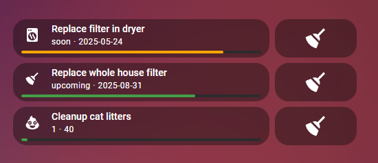

# 🧹 Chore Helper (`chore`)

A custom Home Assistant integration for tracking recurring household tasks as helper-style entities...

---

## 💡 Features

- 🔁 Define recurring chores by interval or usage count
- 📅 Automatically updates due dates and states
- 🧰 Fully compatible with automations and dashboards
- 🧪 Includes built-in services like `chore.complete`, `chore.increment`, and `chore.set_counter`

---

## 📦 Installation

### ✅ HACS (Recommended)

1. Go to **[HACS](http://homeassistant.local:8123/hacs) > Integrations > ⋮ > Custom repositories**
2. Add this repo: `https://github.com/vhonchar/ha-chore`
3. Select **Integration** as the category
4. Find and install “Chore Helper” from the list
5. Restart Home Assistant

### 🛠 Manual

1. Download or clone this repository
2. Copy the `custom_components/chore/` folder into your Home Assistant `config/custom_components/` directory
3. Restart Home Assistant

---

## ⚙️ Configuration

No YAML needed!

To create chores:

1. Go to **Settings > Devices & Services > Helpers**
2. Click **+ Create Helper**
3. Select either:
    - **Scheduled Chore** (due every X days/weeks)
    - **Counter Chore** (due every N usages)

You can then automate or visualize chores as needed.

---

## 🧩 Optional Dashboard Card

To visualize chore progress in your dashboard, you can install the companion **Chore Helper Card**:

👉 **GitHub**: [vhonchar/ha-chore-card](https://github.com/vhonchar/ha-chore-card)

This custom Lovelace card displays a progress bar for each chore based on remaining time or count. It works beautifully with both scheduled and counter-based chores.

> [!NOTE]
> The Chore Helper Card is optional. It’s not required for the integration to function — it simply provides a way to display chore progress visually in the dashboard.

---

## 🛎 Services

This integration provides the following services:

| Service | Description |
|--------|-------------|
| `chore.complete` | Marks the chore as completed and resets its due state |
| `chore.increment` | Increases (or decreases) the counter on a usage-based chore |
| `chore.set_counter` | Sets the counter value directly for a chore |

See the **Services** tab in Developer Tools for full options.

---

## 🐞 Troubleshooting

- Make sure you restarted Home Assistant after installation
- Ensure you're running a recent version of Home Assistant (2023.0+ is recommended)
- Check logs under **Settings > System > Logs** if the integration fails to load

---

## 📄 License

This project is licensed under the MIT License. See [LICENSE](./LICENSE) for details.

---

## 🙌 Acknowledgments

Thanks to [@bmcclure](https://github.com/bmcclure) for sharing his work, [ha-chore-helper](https://github.com/bmcclure/ha-chore-helper), with the community. It served as a great example of how to build a custom integration.

---

**Made with ❤️ for the Home Assistant community**
